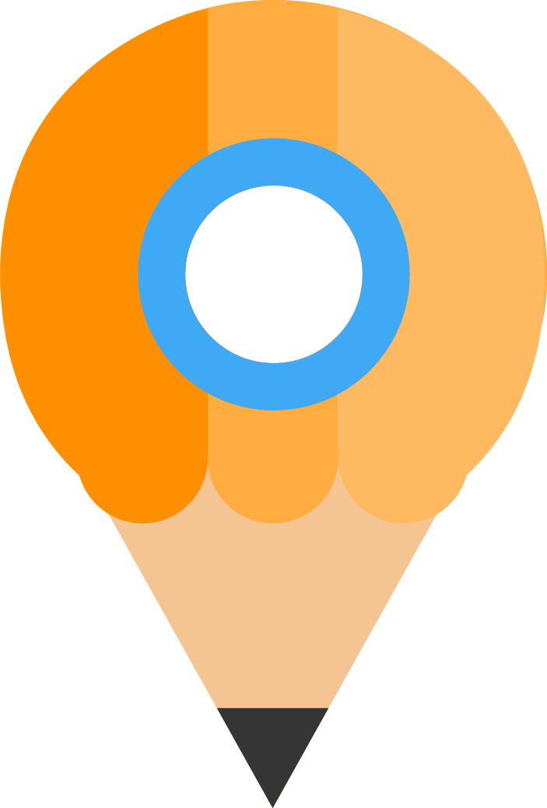

# Geo-Draw

> Geo location based drawing app.

## Demo
See deployed live [demo](https://geo-draw.firebaseapp.com/)

## Installation

## Usage
### Install
1. git clone `git clone`
2. install (Node.js) `npm install -g gulp bower && npm install && bower install`
### Development workflow

#### Serve / watch

```sh
gulp serve
```

This outputs an IP address you can use to locally test and another that can be used on devices connected to your network.

#### Run tests

```sh
gulp test:local
```

#### Build & Vulcanize

```sh
gulp
```

### Deploy

### Firebase

[See detail recipe](https://github.com/PolymerElements/polymer-starter-kit/blob/master/docs/deploy-to-firebase-pretty-urls.md)

Build and optimize the current project, ready for deployment. This includes vulcanization, image, script, stylesheet and HTML optimization and minification.

## Contributing
1. Fork it!
2. Create your feature branch: `git checkout -b my-new-feature`
3. Commit your changes: `git commit -am 'Add some feature'`
4. Push to the branch: `git push origin my-new-feature`
5. Submit a pull request :D

## Credits
TODO: Write credits

## License
TODO: Write license

